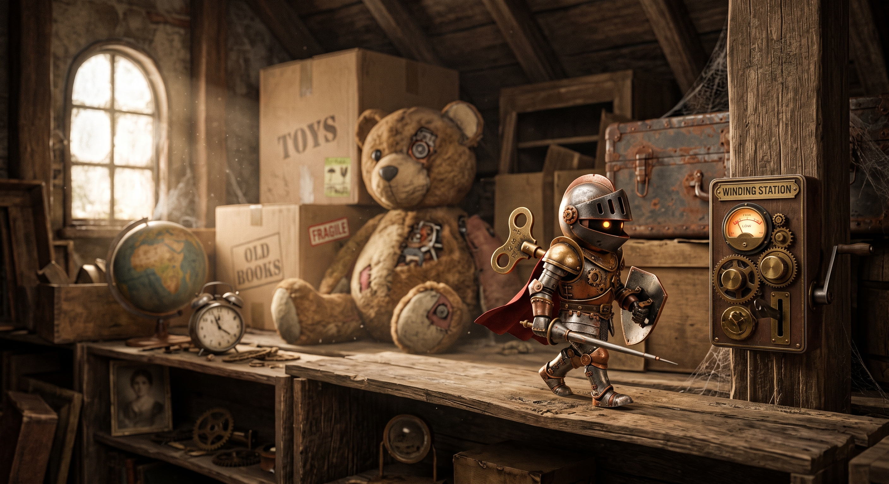
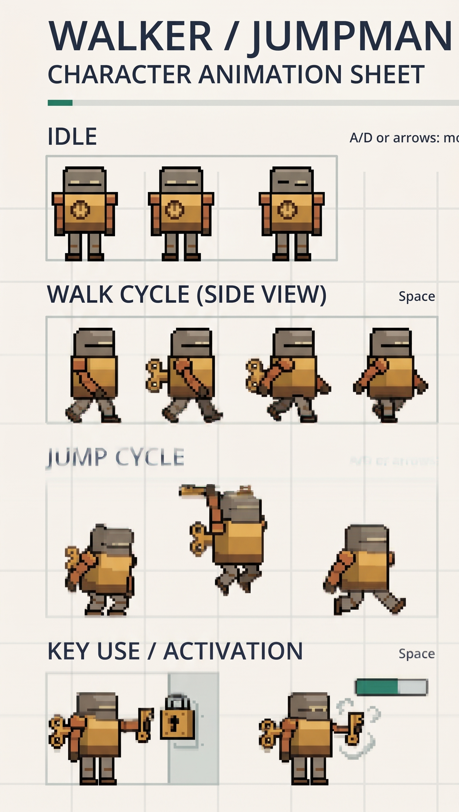
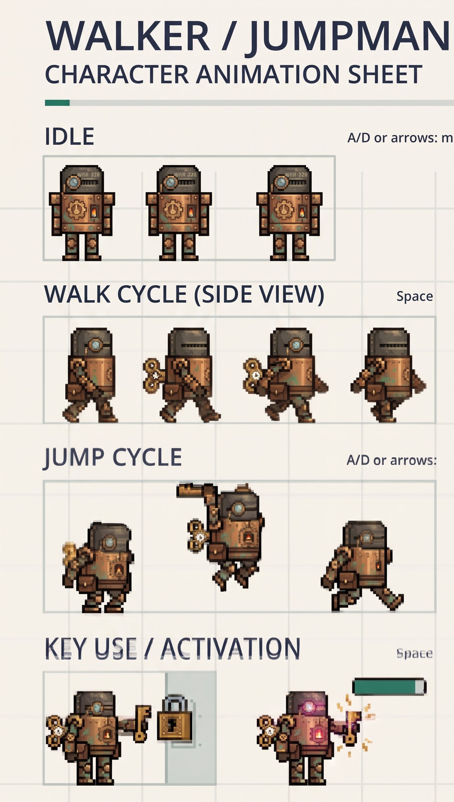

# FRICTIONAL — honest development log

**How this log was made.** The entries below are written retrospectively, at the end
of the project, from my own recollection of what I tried and from the record the work
left behind: commits, the level and tuning files, the diagnostics under
`godot/tests/`, and comments in the code that were written at the time a problem was
fixed. Where a claim is backed by something you can open, I have pointed at it. Where
it is only my memory, I have said so. I have not padded this with invented struggle —
some of the work went in first time, and those entries are short on purpose.

The starter is commit `9387542` (the "First Steps prototype"). Everything discussed
here is the twenty commits after it.

---

## Entry 1 — Concept 1: The Wind-Up Knight, and why I dropped it

**What I tried.** My first concept was a pure platformer with no combat. A small
mechanical wind-up toy escaping a dusty attic full of giant looming toys and
cardboard boxes, in a warm steampunk style. The mechanic was a **tension meter**: it
ticks down as you move, and instead of simply reaching the end of the level you
platform from one **winding station** to the next before you run out of energy and
freeze. My reasoning was that this gives natural tension and a speed-run feel without
needing any enemy programming — which, as a first Godot project, I thought was the
realistic scope.

**Evidence — the original concept art.** Three images survive from that version, all
generated with Gemini. They are kept in the repository rather than deleted, because
the reason I abandoned the concept is visible in them.

**1. The attic, and the winding station.** The mood piece: the knight on a workbench
among a teddy bear, boxes marked TOYS / OLD BOOKS / FRAGILE, a globe and an alarm
clock, with the WINDING STATION panel and its tension gauge mounted on the beam.

**2 and 3. Two character animation sheets** — idle, walk cycle, jump cycle and key
use / activation rows. The first is a plain tan-and-grey body; the second is the
steampunk revision, copper plated and labelled WKR-328.

| [Sheet 1 — tan body](design/concept-1-wind-up-knight/animation-sheet-v1.jpg) | [Sheet 2 — copper "WKR-328"](design/concept-1-wind-up-knight/animation-sheet-v2-wkr328.jpg) |
|---|---|
|  |  |

Put side by side, the two sheets are the problem in one picture: they are different
characters. The proportions, the helmet, the colour and the poses all disagree, the
jump frames do not line up between them, and neither sheet sits on a consistent grid
or a shared pivot. They are pictures *of* an animation sheet rather than an animation
sheet.

The original procedural player rig survives in the code as
[player_visual.gd](godot/features/player/player_visual.gd) and is still named the
Wind-Up Knight rig in its own header.

**What happened, and why I moved off it.**

1. **The art would not converge.** I could not find a reference I wanted to build
   from, so everything came out of AI image generation, and that took a significant
   amount of time per usable image. Worse, what came back was not usable as game art:
   the attic render is a photoreal 3D scene, and the two "animation sheets" are
   *illustrations of* animation sheets — the poses do not match between the two
   versions, there is no consistent grid or pivot, and nothing in them can be sliced
   into strips. They describe a character; they do not give me one.
2. **The level design went static.** With no enemies and one resource mechanic, every
   room came out as the same problem re-spaced. I could not find the second idea.
3. **It was not fun to play.** This is the one that actually decided it. The early
   playtests of the plain platformer were not enjoyable, and I came to think that
   combat would add more to the moment-to-moment game than any amount of further
   platforming refinement would.

**What I learned.** Generated concept art is good at telling me what a game *looks
like* and bad at telling me what it *is*. I spent time on images before I had
established that the core loop was fun, and that was the wrong order. The tension
meter was a mechanic I liked on paper and had no evidence for.

**Unresolved.** I never tested the tension meter properly — I abandoned the concept
on the strength of the platforming feeling flat, not on the meter itself failing. It
may have been a good mechanic in a project with art I could actually make.

---

## Entry 2 — Pivot to Little Fighter 2

**What I tried.** I switched the whole premise to a Little Fighter 2 hack-and-slash
crossed with the platformer starter. LF2 is a game I played with friends as a child,
it has an active modding community I could legitimately draw on, and — the practical
point — its sprite packs are real, consistent, sliceable game art, which is exactly
what Entry 1 could not produce. The protagonist became **Anti-Davis**, a character
mod by A01.

**What I checked.** That the swap would not require rewriting movement. The new
sprite was built as a drop-in replacement for the procedural rig with the same
interface, and the old rig was kept rather than deleted, so the protagonist can be
switched back by changing one `preload` line in
[player.gd](godot/features/player/player.gd). I treated that as the test of whether
the separation was real.

**What I learned.** Choosing a source of art that already exists in the form I need
solved a problem that no amount of prompting had solved. The cost is that this is
fan-made LF2 content: fine for coursework, not something I could release. That
constraint is recorded in [SOURCES.md](SOURCES.md) and in the art provenance files
rather than left implicit.

---

## Entry 3 — Taking one blast, not the whole moveset

**What I tried.** LF2 characters have large movesets. I deliberately did not port
them. I took the basic melee, **one** energy blast rather than the full set of
special attacks, health restoration, and ordinary enemies you clear to progress —
enough that a stage asks for platforming *and* combat, and no more.

**Why.** Every extra move is another thing to balance, and I had no evidence yet that
even one of them made the game better. One projectile is the smallest change that
tests the idea.

**What came out of it that I did not expect.** Because the blast spawns relative to
his feet, a blast thrown at the top of a jump flies about 107 px higher than one
thrown standing. I had not designed that; I noticed it while playing and kept it,
because it turns blast height into a decision — a flat shot passes under a flying
dragon, a jumped shot sails over a bandit standing right in front of you. This is the
one mechanic in the game I would call a genuine discovery rather than a plan.

---

## Entry 4 — The taller character broke the world's scale

**What happened.** The LF2 sprite is much taller than the starter's 18x28 rectangle,
and dropping it in made the starter's geometry wrong: the character no longer fit his
own level properly, and at the starter's 640x360 viewport the art did not land on the
pixel grid — 3/4-size art shown at 1.5x turns every texel into a hard 2x2 block.

**What I changed.** Commit `2a366f1` ("Refactor player mechanics and level design for
taller character"): every tuning value scaled x2 (speed 160→320, jump -320→-640,
gravity 960→1920, terminal 480→960), the collider changed 18x28 → 15x42, and the
viewport moved to 960x540 so one source texel lands on exactly one screen pixel.

**What I checked.** That this was a change of *units* and not of *feel*. Positions,
velocities and accelerations all scale by the same factor, so time to apex is
unchanged at 0.333 s (640/1920 = 320/960), and the coyote and jump-buffer windows are
counted in physics ticks rather than pixels, so they did not scale at all — both are
still 6. The reasoning is written into
[tuning.gd](godot/features/player/tuning.gd) and
[project.godot](godot/project.godot) so the next person to change one number knows
the other has to follow.

**What I learned.** "Make the character bigger" is not a cosmetic change. It is a
change to the unit system of the whole game, and the only reason it stayed safe is
that the forgiveness windows were already expressed in ticks.

---

## Entry 5 — One level got boring, and the story was the fix

**What happened.** I extended the single level past a certain point and it became
mundane — more of the same coast does not make a game. My response was not more
level; it was to give the world a reason to exist.

**What I did.** Wrote the premise (the Holocene earthquakes shattered the world; the
old maps are underwater; what is left floats; he has held one ledge for years until
something wakes up out at sea), and built a four-panel storyboard opening with a
recorded monologue over it. I wrote the dialogue; the voice is ElevenLabs; the panels
are Gemini. The narrative is what then justified varied level design and the combat —
crumbling ground is the reason for a platformer, humming old stones are the reason a
man can throw energy, bandits are the reason there is anything to fight.

**Where it went wrong.** The caption timings. An early pass measured where sound
starts and stops in the recording, found fifteen runs of sound against fifteen script
items, and matched them in order. The result was individually plausible and
collectively wrong — line one alone spans two measured segments because it has an
ellipsis in the middle of it, so everything after it was off by one.

**What I changed.** The timings were re-marked by ear against the recording with
[time_captions.gd](godot/tests/time_captions.gd), and
[diag_speech.gd](godot/tests/diag_speech.gd) was demoted to what it can actually
prove — where sound is, not which words are in it. The correction and the reason for
it are written into [captions.json](godot/ui/captions.json) so the mistake is not
repeated when the mp3 is re-rendered.

**What I learned.** A measurement that is real can still answer a different question
than the one you asked. The audio analysis was correct about energy and useless about
words, and it was confident either way.

---

## Entry 6 — Level design by prompt was random, so I built two tools

**What happened.** Blocking out a level by prompting was fine. Designing a *detailed*
one that way was not. The layouts that came back were random and inconsistent: gaps
that were unclearable or trivial with no discernible reason for either, platforms
placed at arbitrary heights, and — the part that bothered me most — no use of the
background at all. A level was being authored as rectangles in a JSON file by
something that could not see the Magic Cliffs art it would be drawn with, so the
geometry and the scenery ended up as two unrelated documents that happened to load
together.

**What I built.** Two authoring tools, each a single HTML file that opens straight
off disk with no server.

### tools/level-editor.html — geometry you can check

A drag-and-drop layout editor for `godot/levels/*.json`.

- **It is not a second source of truth.** It loads a level file, edits the same
  arrays the game reads, and writes the file back out unchanged apart from what I
  moved. Fields it does not understand are preserved rather than dropped, so it can
  never silently eat a level's story cards or enemy profiles.
- **Palette:** Ground, Island L, Island S, Bridge for terrain; Bandit, Mark, Hunter,
  Crate, Bottle for contents. Select, delete, undo, zoom.
- **It draws the actual jump.** For every gap it plots the real arc from the takeoff
  lip using the same equations the game integrates, marks the furthest point the jump
  can reach, and labels the gap with how much of that reach it consumes — so a gap at
  95% is visibly a different proposition from one at 40%.
- **It says what is wrong in words**, not just in colour: *"pit at 6912 is 214 of a
  possible 190"*, *"pit at 4180 lands 96 higher than the jump rises"*.
- **It shares its maths with the offline checker.** The reachability model is the same
  one in [check_levels.py](scripts/check_levels.py), and both take their numbers from
  [tuning.gd](godot/features/player/tuning.gd). I deliberately did not let the editor
  invent its own jump model — a design tool that disagrees with the game is worse than
  no tool.

### tools/asset-painter.html — layout on top of the real art

The answer to the background problem. Instead of placing abstract boxes, it fetches
the actual Magic Cliffs sheets and their atlas from
`godot/features/world/art/magic_cliffs/` and paints with them, so what I am looking at
while placing a ledge is what the game will draw. It exports a level JSON with the
theme already set, either copied to the clipboard or downloaded, and it can import an
existing level to carry on from.

**What I checked.** That both tools are authoring aids and nothing else: the game
loads the same JSON whether a tool, a text editor or a script wrote it, and
`check_levels.py` is still the gate. A level built in the painter and a level typed by
hand are indistinguishable to the engine.

**What I learned.** The failure was not that the AI designed levels badly — it was
that it was designing blind, with no feedback on either reachability or appearance.
Both tools are really the same fix: put the consequence on screen at the moment of the
decision. Once the arc was drawn over the gap, bad gaps stopped being a matter of
opinion.

**Unresolved.** The editor holds its own copy of the tuning numbers
(`TUNE = {speed:320, jump:640, gravity:1920}`) rather than reading `tuning.gd`. That
duplication is a live hazard and is flagged in the file's own header comment: change
the tuning and forget the editor, and it will quietly bless gaps the game cannot
clear. I kept it because the tool has to run from `file://` with no build step, but it
is the thing in this project most likely to go stale.

---

## Entry 7 — Bosses, and wanting them to actually stop you

**What I tried.** After two levels I felt the narration and the game both needed
bosses. I wanted them to feel like the original Dark Souls games: a boss is a wall
you have to beat to move on, not an optional encounter. The boss sprites came from
other artists' packs (Dragon Lord, and the flying dragon), so they do not assimilate
perfectly into the world I had built — I accepted that and altered the narrative to
fit them in rather than pretend the seams are not there.

**What I built around them.** A boss track that swaps the level's music for as long
as the boss is alive and is mixed forward of it, story cards around the fight, and
The Climb inserted before the final boss so there is one short, hard, purely
mechanical test between the last ordinary level and the Roost.

**What I checked.** [diag_boss_health.gd](godot/tests/diag_boss_health.gd),
[diag_battle_music.gd](godot/tests/diag_battle_music.gd) and
[diag_arena_seal.gd](godot/tests/diag_arena_seal.gd), added in commits `b7dff44` and
`8a6e3b2`.

**A real one I nearly shipped.** The boss track `decisive_battle.wav` was matched by a
`*.wav` line in `.gitignore` with no exception under it, so only its `.import` was
ever committed. Every clone reached **both** dragon fights with no battle music at
all. The tests did not catch it because they compared a track *name* rather than a
stream — the name was right, the file was absent. Fixed by unignoring
`godot/audio/*.wav`, with the reasoning written into
[.gitignore](.gitignore) at the line that caused it.

**What I learned.** A test that asserts configuration rather than behaviour will pass
on a broken build, cheerfully. This is the mistake in this project I am least happy
about, because the test existed and gave me confidence.

---

## Entry 8 — What playtesting actually broke

This is the bulk of the work after the levels existed. I played the fights repeatedly
and tuned movesets, health, damage, abilities and the fight music to keep the
difficulty challenging rather than either trivial or unfair. The specific failures,
each with what I changed and how I checked it:

**8a — The bosses and enemies were simply too easy.** Constant tinkering rather than
one fix: per-enemy profiles for damage, cooldown, stagger, knockback and aggro range
live in [enemy.gd](godot/features/combat/enemy.gd) and were adjusted against repeated
play. Checked by playing, and by the combat runs recorded under `evidence/`.

**8b — Enemies walked off cliffs.** They would path straight off a ledge and die
without my involvement, which is neither a fight nor a threat. Fixed with an edge
probe ahead of the feet, a landing search, and a `DROP_LIMIT` of 120 px — the biggest
drop an enemy will take on purpose. Their jump was also set deliberately weaker than
the player's (apex 101 px against his 107) so that there is nowhere they can reach
that he cannot leave, and nowhere he can stand that they cannot follow.

**8c — I could drag them off the cliffs.** The same `DROP_LIMIT` is what stops this:
an enemy will not step off a ledge chasing me just because I am standing below it.

**8d — Static movement, and no follow-up if I did not engage.** Two opposite bugs
that had to be solved together. With no aggro gate, every enemy in the level set off
the moment it loaded and the first hunter arrived while I was still on the opening
ledge. With aggro gating them permanently, I could back off three steps and watch a
bruiser give up, turn around and stand there, which reads as the enemy being broken.
The fix is a latch: `engaged` is set by walking into aggro range *or* by being hit
from outside it — so a blast from across the room starts a fight rather than poking a
statue — and once set, aggro stops gating him and he follows. It clears only on
retry. Checked with [diag_aggro.gd](godot/tests/diag_aggro.gd).

**8e — I could just run past everything.** Skipping the level by sprinting through it
made the combat optional, which defeats the point of adding it. Fixed with section
gates: a level cuts itself into sections, and while any enemy still holds its
section, that wall is solid and the camera stops with it. Perch hunters on high
shelves originally did *not* hold their gate — so standing up there sniping and never
having to be dealt with was a live exploit until `holds_gate` was made true for
everything.

**8f — I walked back out of a sealed boss fight.** The Fractured Isles wakes its
dragon from a story card at x=6960, 48 px past the seal line at 6912. The margin
before the wall latched was 64, so it never latched at all, and the **first run** of
[diag_arena_seal.gd](godot/tests/diag_arena_seal.gd) watched the player stroll back
out over the stones with the fight still on. Margin reduced to 24 — one wall width,
enough that he is clear of the wall and cannot be caught inside it when it turns
solid.

**8g — Spamming K made the whole game trivial.** The energy blast had no cost, so the
answer to every encounter was to hold the button. I added a **mana drain** to make the
blast a resource. Then I over-corrected: at 20 points a shot the bar emptied in five
blasts and only a brown bottle brought it back, which made the blast something to
hoard rather than use — the opposite of the reason I gave him one. Settled at 5 per
shot against a bar of 100, regenerating 5 every ten seconds, so a full bar is twenty
blasts and one free shot always arrives eventually. Running dry disarms him
temporarily; it never kills him. Separately, the flying dragon now *reacts* to being
spammed: repeated blasts stack, and past a threshold it stops waiting out its swoop
and climbs out of the lane instead of absorbing them.

**8h — Consecutive-frame damage read as a bug.** An enemy standing inside the player
landed hits on consecutive frames and emptied the health bar in about a third of a
second. Added a 0.6 s invulnerability window between blows.

**What I learned across all of these.** Almost every one is the same shape: a rule
that was right in isolation produced nonsense at the boundary — aggro that never
released, a seal margin measured against the wrong landmark, a cost that fixed spam
by making the ability worthless. Playing the thing found all of them; none were found
by reading the code.

---

## Entry 9 — Things that worked first time

Recording these because not everything was a fight, and padding this file with
invented difficulty would be dishonest.

- **The starter's control, retry and pause slice was never a problem.** The bindings
  (A/D/arrows, Space, Esc/P, R, Enter, M) and the retry and pause behaviour carried
  through the entire conversion unchanged; new actions were added alongside them
  rather than over them. The shape of the change is visible in the diff:
  `godot/game/session.gd` is 1911 insertions against 49 deletions from the starter —
  the original slice was extended, not replaced.
- **The sprite swap did not touch movement code**, which is what Entry 2 predicted
  and is checkable by the fact that the old rig still works as a one-line fallback.
- **The 47-hop Climb worked as a level almost immediately** once the geometry was
  generated; its problems were about difficulty and framing, not correctness.

---

## Entry 10 — Unresolved questions

- **I never tested the Wind-Up Knight tension meter.** It was dropped on the art and
  the flatness of the platforming, not on its own merits.
- **The bosses do not belong to the world visually.** The Dragon Lord and the flying
  dragon come from different artists' packs than the environment, and I papered over
  it with narrative rather than art. I think it still shows.
- **I do not know whether the difficulty is right for anyone but me.** Every balance
  pass in Entry 8 was tuned against my own play, and I have played these fights far
  more than any first-time player will. What feels challenging to me is probably
  unfair to them.
- **The seal-and-gate design makes the game unskippable, which I wanted — but I have
  not checked what it does to a player who is stuck.** There is no way past a boss you
  cannot beat.
- **Fan-made LF2 art is not releasable.** The game cannot be published as-is, and I
  have not sourced replacements.

---

## Human and AI contributions

**Mine.**

- The pivot from the Wind-Up Knight to LF2, and the reasons for it.
- The decision to cut the LF2 moveset down to melee plus one blast plus health.
- The world premise, the hero's-journey structure, the level order, and the
  storyboard beats.
- The dialogue and monologue script, written by me.
- All difficulty and balance judgements: what was too easy, what felt unfair, what
  needed a cost. Every failure in Entry 8 was found by me playing the game.
- The call to put The Climb on the course, and to bring First Steps back onto it.
- Diagnosing that prompt-generated level layouts were random, inconsistent and blind
  to the background art, and specifying the two tools that replaced that workflow —
  what they had to show me, and the rule that they must not become a second source of
  truth (Entry 6).

**AI, and what I did with it.**

- **Gemini** — concept images, storyboard panels and game panels. *Accepted:* the
  storyboard panels, which are used in the opening and in the in-level cards.
  *Rejected:* the Wind-Up Knight concept art as a basis for the game; it was slow to
  produce and could not be turned into usable sprites (Entry 1).
  *Accepted later:* two Dragon Lord defeat panels. **Correction to an earlier version
  of this file**, which recorded them as generated-and-discarded on the evidence that
  nothing in the codebase referenced them. That was true when it was written and is
  not true now: they became the two victory cards after the Roost fight, and the
  second is drawn a third time under the thank-you card. Left visible as a correction
  rather than edited away, because "the AI generated this and I threw it out" and "I
  had not used it yet" are different claims and I made the wrong one.
- **ElevenLabs** — the voice performance of the opening monologue. *Accepted*, over my
  own script. The delivery tags in the script (`[whispers]`, `[curious]`) are
  deliberately not shown in the captions; they are instructions to the voice, not
  words he says.
- **Claude (Claude Code)** — implementation, refactoring, the diagnostics under
  `godot/tests/`, the two authoring tools in `tools/` to my specification, and the
  documentation. *Accepted:* the tick-based scaling argument
  in Entry 4, the aggro-latch design in 8d, and the section-gate mechanism in 8e.
  *Modified:* the blast cost, which I moved from 20 to 5 after playing it. *Rejected:*
  the first caption-timing pass in Entry 5, which was internally consistent and wrong,
  the earlier boss-music test in Entry 7, which asserted a track name and passed
  on a build with no music file in it, and prompt-authored level layouts altogether,
  which I replaced with the tools in Entry 6.
- **Little Fighter 2 and the itch.io artists** are asset sources, not AI, and are
  credited in [SOURCES.md](SOURCES.md).

The division I would draw: the AI was faster than me at everything that could be
checked mechanically, and unable to tell me whether any of it was fun. Every change in
Entry 8 came from playing.
