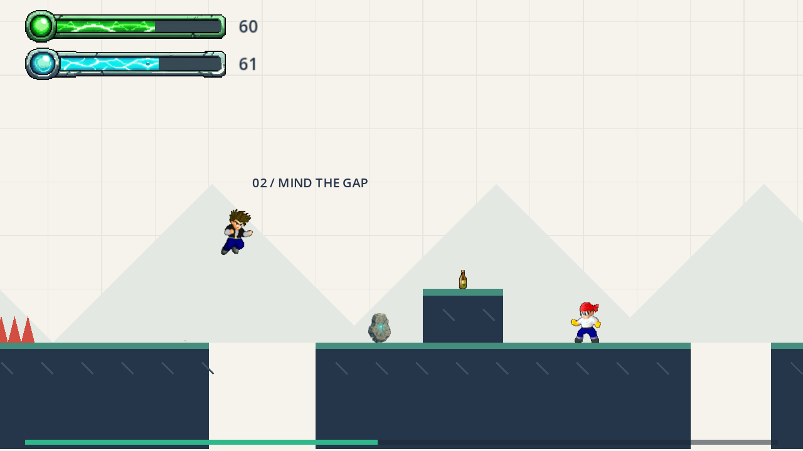

# walker-jumpman — First Steps

**Playable source prototype · September 10, 2026 · Godot 4.7.2 / GDScript**

Standalone game repository: [nikbearbrown/walker-jumpman](https://github.com/nikbearbrown/walker-jumpman). This checkout contains only this game's source, design package, and test evidence—not the Walker toolkit, Brutalist, or video renders.

Clone with `git clone https://github.com/nikbearbrown/walker-jumpman.git`, then import `walker-jumpman/godot/project.godot` in the regular Godot editor. No .NET runtime or external assets are required. On macOS, the launcher below also works when Godot is installed in Applications; on other platforms, use the editor or `godot --path godot` from the cloned folder.

Double-click [walker-jumpman.command](walker-jumpman.command) to play. The game opens on the title screen: **NEW JOURNEY** starts the course in The Fractured Isles, **PRACTICE** drops into the First Steps greybox slice, and **LOAD GAME** opens the in-game level list (**W/S or up/down** to choose, **Enter** to start). In play, **A/D or left/right** to move, **Space** to jump, **J** to attack or throw, **K** to blast, **E** to lift or drink, **R** to retry, **Escape/P** to pause and **M** for the menu. Reach the flag. Retries are unlimited, and finishing a level goes straight to the next one.

The title screen and The Fractured Isles share the Magic Cliffs loop — the pack ships one track — so starting a new journey carries the music straight on rather than restarting it. The greybox slices are silent. Music lives in [music.gd](godot/game/music.gd), the one node in the project that outlives a scene.

The stage is cut into sections and you do not walk past a fight. While enemies are still standing in your section the camera stops dead, an invisible wall stands on the line, and you can see you have run out of screen rather than out of floor; put them down and both let go, with a chevron at the edge to say so. Walking back is never blocked. The Fractured Isles is four sections, the last being the Archway platform where the boss fight will go — it has no gate yet, so the flag ends it.

Two bars sit in the top corner. Health is the green one: punks take it, the white milk bottles give it back, and spikes and pits ignore it entirely — those are still instant deaths. Mana is the blue one, and the blast is the only thing that spends it: five a shot out of a hundred, so twelve shots from a spawn and twenty on a full bar. It also trickles back on its own, a shot's worth every ten seconds, and the brown bottles top it up faster. Punching and kicking stay free, so an empty mana bar costs you the ranged option for a few seconds and nothing else.

Neither bar snaps. Both slide to their new level over about a third of a second, while the number beside them changes at once — so a hit or a blast is something you watch land, and the slow refill is visible as movement rather than a figure that is quietly different next time you look.



This simple level has two steps, two gaps, one spike hazard, and a finish. It is the control/retry slice, not the full three-zone/cherry design below. See [build results and limitations](BUILD-REPORT.md). To edit, import [godot/project.godot](godot/project.godot) into Godot.

The first Walker example is a compact 2D platformer built around readable jumps, optional cherries and quick retries. Every new game project uses the `walker-` prefix. The original `jumping-man-godot` recovery collection remains separate and unchanged; it is not included or required here. Historical design references to sibling recovery files refer to the author's local source collection, not files shipped in this repository.

## Read in this order

1. [Game brief](GAME-BRIEF.md) — the short player-facing idea and proposed scope.
2. [Detailed GDD](GDD.md) — sixteen design sections, source evidence, requirements and twenty-two acceptance cases.
3. [Level design](LEVEL-DESIGN.md) — the three-zone course and its untested geometry.
4. [Production plan](PRODUCTION-PLAN.md) — twenty-two dependency-ordered tasks across six phases, plus four deferred tasks.
5. [Playtest plan](PLAYTEST-PLAN.md) — mechanical tests, formative human sessions, evidence and revision rules.
6. [Asset plan](ASSET-PLAN.md) — original greybox requirements and the provenance boundary.
7. [Design status](DESIGN-STATUS.json) — machine-readable revision, decisions, pending approvals and honest runtime state.


[Design consistency review](DESIGN-REVIEW.md) · [Editable SVG map](design/level-overview.svg)

[Level coordinate data](design/level-01.json) drives this candidate blockout. Counts and geometry can be checked without Godot. Jump reachability, zero-cherry/all-cherry routing, camera behavior and enjoyment have not been tested.

## Adding a level

Levels are data. One JSON file each in [godot/levels/](godot/levels), and
[index.json](godot/levels/index.json) says which of them are *the course* and in
what order — the only file that knows how long the game is. The course is The
Fractured Isles and nothing else: NEW JOURNEY starts at the top of that list, and
a new game should not open on a greybox.

First Steps and Proving Ground are still shipped, still validated and still
playable — First Steps is what PRACTICE boots — they are simply off the course.
First Steps is the tutorial and prototyping slice: it introduces every mechanic
once, and it is what the test suites are written against.

To add one, write `godot/levels/<id>.json`; put `<id>` in the index's `order` to
make it part of the course, or leave it out to keep it off. Nothing else changes
— the menu, the title, the progress bar, the background signs and the chain to
the next level all read from the file.

| key | shape | meaning |
|---|---|---|
| `title` | string | the menu row, and the results panel's "Next:" line |
| `tagline`, `brief` | string | the results panel, and the menu blurb |
| `width` | number | right wall; the camera stops half a viewport short of it |
| `fall_y` | number | below this is a death, so it must be under every floor |
| `spawn` | `[x, y]` | his feet, which must be the top surface of a solid |
| `solids` | `[[x, y, w, h]]` | platforms and floor; `y` is the **top** edge |
| `hazards` | `[[x, y, w, h]]` | spikes. Instant death, unchanged by health |
| `finish` | `[x, y, w, h]` | the flag; `y + h` has to meet a solid's top |
| `crates` | `[[x, y]]` | optional. Breakable, throwable, never an obstacle. Drawn as the glowing rock; the key is the slot, not the art |
| `bottles` | `[[x, y, bars]]` | optional. White milk bottles; `bars` is **health-bar segments, 1–5**, not points |
| `brews` | `[[x, y, bars]]` | optional. Brown bottles, same units against the **mana** bar |
| `enemies` | `[[x, y]]`, `[[x, y, kind]]` or `[[x, y, kind, "perch"]]` | optional. One entry each. `kind` is `"bandit"` (the default), `"mark"` or `"hunter"`; each is a folder under `features/combat/art/` cut by `scripts/extract_<kind>.py`. `"perch"` marks one that does **not** hold its section's gate |
| `gates` | `[x, ...]` | optional. Section end walls, left to right. Three gates make four sections |
| `signs` | `[[x, y, heading]]` or `[[x, y, heading, subtitle]]` | background text, in world coordinates |
| `hills` | `[x, ...]` | optional, greybox only. Omit and six are spaced evenly across the width |
| `theme` | string | optional. Names an art set in `features/world/art/`. Omit for the greybox look |
| `music` | string | optional. Names a track in `godot/audio/` without its extension. Omit and the level is silent |
| `decor` | `[[x, y, piece]]` | optional, themed only. Art with its bottom edge at `y`. Never collision |
| `horizon` | number | optional, themed only. The waterline the parallax layers sit on |

### Themes

A level with no `theme` is drawn procedurally by `session.gd`, the original
greybox: flat rectangles, drawn hills, a flag. First Steps and Proving Ground
are these.

A level with one is drawn by [scenery.gd](godot/features/world/scenery.gd) from
the same data. **Terrain is not authored** — the cliffs, grass and caps are
generated from the level's own `solids`, the identical rectangles the player
collides with and the validator measures, so the art cannot end up somewhere you
cannot stand or be missing somewhere you can. Only set dressing is placed by
hand, because a tree is a decision rather than a consequence of the geometry.

A solid may name the art it wears as an optional fifth value:

| `solids` entry | drawn as |
|---|---|
| `[x, y, w, h]` | a grassed cliff: grass strip over a filled body, rock caps on the ends |
| `[x, y, w, h, "island_large"]` | that piece, centred, its standing surface on the rectangle's top edge |
| `[x, y, w, h, "bridge"]` | planking, with an anchor post at each end |

`magic_cliffs` is the only theme so far — Ansimuz's **CC0** pack, and the only
licensed art in the project. Its tiles are 16 px, which is **12 world units** at
the game's 0.75 render scale, so those levels are authored on a 12-unit grid.
See [its provenance](godot/features/world/art/magic_cliffs/PROVENANCE.md).

Then check it before playing it:

```
python scripts/check_levels.py
```

That reads the jump envelope out of `features/player/tuning.gd` — currently
**213 px of flat travel and 107 px of rise** — and fails on a gap no jump can
clear, a spawn or prop hanging in the air, a fall line above the floor, a finish
that does not meet the ground, or a bottle written in health points instead of
bars. It warns, without failing, on a gap above 80% of the envelope. A movement
change invalidates every gap in every level, and this is what says so.
`python scripts/test_check_levels.py` checks the validator still rejects what it
claims to. `tests/capture_levels.gd` renders the menu and every level.

Then look at the route you just changed:

```
python scripts/map_level.py
```

That writes `evidence/maps/<id>.png`: the whole course as a strip map, on the
tile grid, with every mandatory gap measured against the jump envelope and the
real jump arc drawn off each ledge. The validator says whether a gap is
clearable; the map shows by how much, which is the question you have while
moving a platform.

### Editing the layout

[tools/level-editor.html](tools/level-editor.html) is a drag-and-drop editor for
the same files. Serve the repo and open it, so it can load the levels itself:

```
python -m http.server 8777
```

then <http://127.0.0.1:8777/tools/level-editor.html>. Opened straight off disk it
works too, but you have to click **Open level** and pick the file.

Drag platforms to move them, drag the right-hand handle to resize, click to
place bandits, crates and bottles, `Delete` to remove, `Ctrl+Z` to undo.
Everything snaps to the 12-unit tile grid, and a prop dropped over a platform
snaps to its surface so it can never be left hanging.

The point of it is the feedback: the jump arc off every ledge is drawn live, and
the **Route** panel scores each gap as a share of the envelope the moment you let
go — so a platform dragged out of reach goes red while you are still holding it,
rather than at the next validator run. **Download JSON** writes the file back
with every field it does not understand preserved.

The **Ground shape** panel tunes the rock itself with sliders: how far the cliff
faces lean in, how tall each break is, how far the edge wanders, how strong the
cave texture is, the width below which a platform stays square, and a nudge for
each rock column. The canvas draws the real leaning, broken wedge while you drag,
the two columns as coloured bands so a nudge is visible, and the collision
rectangle dashed over the lot so you can see they are not the same thing.

### Drawing an edge by hand

Select a plain ground block and the **Outline** panel offers *Draw this edge by
hand*. It seeds a set of handles from the shape the block already has, then you
drag the dots to draw each face however you like. A block with a drawn outline
ignores lean, break and jitter entirely: the handles ARE the shape.

Outlines are stored under `ground.profiles`, keyed by the block's own left x, and
read straight back by the renderer. *Back to automatic* deletes one; a level with
none carries no block at all.

The columns are aligned by their ART, not by their rectangle. Both carry four to
eleven pixels of transparent margin on their outer side, so lining them up by the
sprite box left a sliver of flat fill down every face; the extractor records that
margin as `bleed` and the renderer backs each column out by it. The nudges are on
top of that, for aligning by eye.

Those values are saved into the level as a `ground` block and read straight back
by [scenery.gd](godot/features/world/scenery.gd), so the numbers cannot drift
between the tool and the game. A level left at the defaults carries no block at
all.

It is a convenience, not an authority. `scripts/check_levels.py` is the gate, and
the editor's jump constants are a copy of `tuning.gd` — change the movement and
you must change `TUNE` at the top of the HTML, or it will bless gaps the game
cannot clear. The ground defaults are a copy too, but only the defaults: anything
you actually tune lives in the level file.

## Enemies

Three enemies share one script
([`features/combat/enemy.gd`](godot/features/combat/enemy.gd)) but fight to
different personalities, keyed by kind in its `PROFILES` table. Place any of them
with `[x, y, "kind"]` in a level's `enemies` array.

| kind | style | plays as |
|---|---|---|
| `bandit` | charger | rushes you: from mid-range he commits a fast dash, so standing still in front of him is punished. An even match otherwise — one bar of health, one bar of damage. Even the charge stays slower than your run, so leaving is always an answer. |
| `mark` | bruiser | the tank: far more health, a heavier blow, and **super-armour on his own swing** — catch him mid-punch and he eats it and follows through, so you cannot trade jabs and win. Slow, though; the answer is footwork, not standing your ground. |
| `hunter` | archer | keeps his distance and **looses arrows** across the gap, kiting backwards to hold the range. Draws the bow, fires a straight-flying arrow, and is forced to his fists only if you close on him. Fragile. |

Every kind stands where the level put it until the fight starts — walk inside its
`aggro` range, or hit it from outside — and **after that it follows you**, however
far you back off. Aggro decides when a fight begins, not whether it continues: an
enemy that lets you take three steps back and then turns round and stands there
reads as broken rather than as an escape, and the section gates will not let you
leave the fight anyway. A retry puts everyone back on their mark and forgets it.

**They jump.** Once a fight is on, the terrain is their problem rather than your
free win: a gap is leapt, a ledge is climbed, and a player who jumps clean over
their heads is followed up and swung at on the way. The swing is the same swing —
the hit box rides the sprite, so it is high when they are. Three rules keep it
from being oppressive:

* **They only jump when jumping is the answer.** Level floor is walked. The
  triggers are a gap or a step in the way, or you being above them.
* **A jump they cannot make is not attempted.** Each kind carries a `leap` speed,
  which with a fixed 0.75 s of air time sets how wide a gap it can cross: on the
  Fractured Isles a bandit takes the 24, 60, 72, 96 and 120 px gaps and stops at
  the lip of the 132s and the 168; Mark, heavier, gets the short ones and nothing
  else. Nothing walks into a pit any more — falling in used to open that
  section's own gate for free. `tests/diag_gaps.gd` prints the whole table for a
  level, which is how you find out whether a chasm you just authored is one the
  fight can follow you across.
* **Their jump is smaller than yours.** 101 px against your 107, so there is
  nowhere you can climb to that they can follow but you cannot leave — and the
  hunters perched on the Isles' high shelves, 144 px up, stay out of the fight,
  which is what the gate design rests on.

A leap is committed: there is no steering once they are off the ground, so it can
be sidestepped like the bandit's charge. Hit one in mid-air and the stagger takes
its momentum with it — it drops out of the leap rather than finishing it. And
landing leaves them flat-footed for a moment, so being somewhere else when they
come down is the answer to one that follows you up.

The hunter jumps for terrain only, never at you. An archer who leaps has given up
the one thing he is for; his answer to a player on a ledge is to back off and
shoot.

The personality lives entirely in `PROFILES` — health, speed, damage, cooldown,
knockback, leap, and how it closes (walk, charge, or shoot and kite). A kind with
no row falls back to a plain walker. Art, reach and hit geometry still come from each
kind's manifest, so you can retune a bruiser without recutting a sprite. The
hunter's arrow is its own object ([`features/combat/arrow.gd`](godot/features/combat/arrow.gd)) —
the LF2 rip has his bow-draw frames but no arrow, so the shaft is drawn, not cut.

`godot --path godot --script tests/capture_enemies.gd` renders each kind in the
game — including the hunter's arrow in flight — to `evidence/<kind>/`.

## Proposed defaults ready for review

Godot 4 with typed GDScript, Compatibility rendering, one three-zone level, twenty optional cherries, one fixed-height jump with small forgiveness windows, hazards, quick retries, keyboard controls and a locally tested Web export. No paid services. No moving-platform dependency in the MVP.

The tested engine is Godot 4.7.2.stable.official.ed1daf0bf. Zelda's reusable prompt and command/workflow specification belong to the separate Walker toolkit and are not dependencies of this game.

## Current boundary

The full design is still a draft. Bear subsequently authorized **“Build a simple level for walker-jumpman.”** The first slice is implemented and machine-tested; full-design approvals, human playtesting, cherries/settings, and the Web export remain pending. This is a source-code release, not a hosted game or downloadable executable. The build report and test receipts preserve the earlier local-build history.

Next: play this small control/retry loop before expanding the course. The human owns intent, scope, play-feel judgments, and release decisions; AI implements and checks authorized work. The original `/Users/bear/walker-jumpman` stays untouched.
