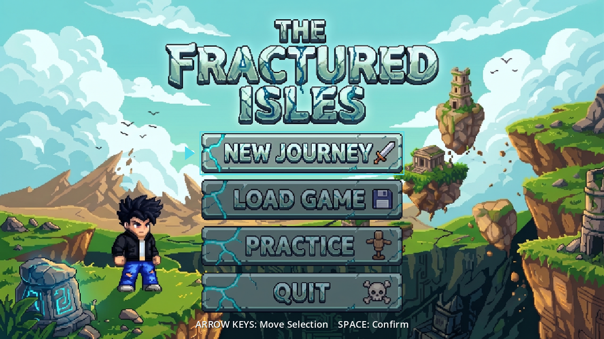

# The Fractured Isles

**A hack-and-slash platformer · Godot 4.7.2 / GDScript · keyboard · single player**



Built on the `walker-jumpman` starter, rebuilt as a Little Fighter 2–style
hack-and-slash crossed with a platformer. Four levels, an opening cutscene with
recorded narration, three kinds of enemy and two boss fights.

**▶ [Watch the gameplay recording](https://northeastern-my.sharepoint.com/:v:/g/personal/gangurde_a_northeastern_edu/IQDO9wMrkFdCTZviPp21xJroAfd-io9MefBzNcI4GRw95o4?e=jQvlwQ)** — hosted on Northeastern SharePoint; opening it asks for a Northeastern sign-in.

## The story

The Holocene earthquakes broke the world and shattered it into pieces. The old maps
called this place Earth; the old maps are underwater now. What is left floats — and
what floats, you keep.

You have been the warden of these isles for years, holding one ledge against nothing
worse than weather — no war, no wound, just salt off the water and the old stones
humming to themselves. Then something explodes out over the sea. You know every sound
these isles can make, and that is not one of them.

*"So whatever just woke up out there… you should have slept a LITTLE longer. I've had
years to get bored."*

So you go and look. Out past the crumbling coast and the bandits working it, to the
archway at the far end of the isles — and what is waiting under it is a drake, which
is not something these islands have ever had. You put it down. It does not die: it
gets up, takes to the wing, and runs.

*"It's running away — and the only way off these floating isles is up."*

So you climb. Seven screens of rock with the sea underneath, up to the roost at the
top of the world, where the drake has gone to ground and something older has come
looking for it. The Dragon Lord finds his own blood hurt, wants someone to answer for
it, and settles on you.

*"YOU! Pathetic human, this island warden. I will shatter your bones just as I have
shattered many such pitiful worlds."*

Two dragons, one ledge, and the same job you have held all along. Put both of them
down and the Dragon Lord leaves the way everything leaves these isles — on the wing,
promising to come back for it. You tell him exactly where you will be.

*"…and I will be waiting right here at my fragmented islands, demon!"*

## The course

Four levels, played in order. Each one asks for something the one before it taught.

| # | Level | What it is |
|---|---|---|
| 1 | **First Steps** | The practice coast. Five short stretches, nothing in it that has not been introduced first. The only level that shows key prompts. |
| 2 | **The Fractured Isles** | The crumbling coast and a bridge ambush, as one continuous course, ending on the archway where the dragon waits. |
| 3 | **The Climb** | A mountain, not a course. One screen wide and seven screens tall, 47 hops with the sea underneath. The view ratchets upward and never comes back down. |
| 4 | **The Dragon's Roost** | One arena, two bosses, a flag. The level *is* the fight. |

**NEW JOURNEY** plays the opening and then runs the whole course, each level loading
the next. **PRACTICE** drops straight into First Steps. **LOAD GAME** opens the level
list so you can replay any level you have reached. **QUIT** exits.

## Controls

| Key | Action |
|---|---|
| **A / D** or **← / →** | Move |
| **Space** | Jump |
| **J** or **X** | Attack — punch, chain into a cross, kick in the air, shoulder charge at a run, or throw what you are carrying |
| **K** or **C** | Energy blast. Costs mana. Can be thrown in mid-air |
| **E** | Lift a crate or rock; hold to drink a bottle |
| **R** | Retry. Unlimited, instant |
| **Escape** or **P** | Pause |
| **M** | Level menu |
| **W / S** or **↑ / ↓** | Move the selection in a menu |
| **Enter** | Confirm a menu choice |

Reach the lit stone at the end of a level to finish it. Finishing goes straight to the
next level.

> **Note:** the title screen prints "SPACE: Confirm", but `confirm` is bound to
> **Enter**. Use Enter on the title screen. This is a known bug, not a documentation
> error — see the end of this file.

## Running it

There is no packaged build. Play it from source with Godot 4.7.2:

```bash
godot --path godot
```

Or import `godot/project.godot` in the Godot editor and press play. On macOS with
Godot installed in Applications, [walker-jumpman.command](walker-jumpman.command) also
works. No .NET runtime and no external asset downloads are required — everything the
game loads is in this repository.

## How it plays

The title screen, the opening's title card and all four course levels share the Magic
Cliffs loop — the pack ships one track — so starting a new journey carries the music
straight on rather than restarting it. First Steps names the same track, so PRACTICE
carries it on too; the greybox test fixture is silent. Music lives in
[music.gd](godot/game/music.gd), the one node in the project that outlives a scene.

The stage is cut into sections and you do not walk past a fight. While enemies are still standing in your section the camera stops dead, an invisible wall stands on the line, and you can see you have run out of screen rather than out of floor; put them down and both let go — the wall at once, the camera over about half a second, panning forward rather than cutting, with a chevron at the edge to say so. That pan is the only smoothing on the camera's horizontal: a fight backed into a gate ends with you pressed against the wall, which is the furthest the framing ever has to travel, and it used to travel it in one frame while you were still mid-swing. Walking back is never blocked — **except out of a boss fight**. The dragon is fenced into its arena, so a player who walked west out of that arena stood somewhere it could not follow and the fight simply stopped happening. A level names the line its fight is sealed behind (`boss_arena`), and a wall stands there from the moment the boss wakes with the player inside until its body is gone, with the camera stopping against it exactly as it stops against a gate. The Fractured Isles puts it at 6912, the lip of the dragon's deck: its section opens at 6110, out in the middle of the chasm, so sealing there would leave the four stepping stones inside the fight — the ledges he crossed to get there — and stand the wall in mid-air over the water. The Dragon's Roost puts it at 816, the first ground past the only gap in that level, and deliberately not at 1512 where its two bosses actually stand: the west floating stone is at 1188, and the two stones are the only way to reach the flying one. The boss is fenced to the same box either way, so it and the player are shut in one room. The Fractured Isles is five sections; the dragon's is the fourth, and a gate at 7800 stands behind it so the way out cannot be reached with the boss still up. It had no gate once, and the level could be finished by running underneath the fight.

**Prompts belong to First Steps and to no other level.** Walk up to something you can lift and a small plate appears over it with the key on a cap — `E` `LIFT`, `J` `THROW`, `HOLD E` `DRINK 6.0s` — and it stands over the THING, so with two rocks in reach it says which one it means. It used to be a line of outlined text centred on the screen, which put the words E / LIFT in the middle of a pit on the far side of the frame from the rock they were about, in the same face and at the same size as the death banner. Two of them name a bar instead of a thing: drink, and the bar that bottle pours into is named beside it while it climbs; throw your first blast, and the one it came out of is named for a couple of seconds while it dips. Nothing else in the game ever says what the green bar and the blue one are. One level sets `hints` and it is the first one: the course teaches the hands in its opening level, and a game still naming keys on its third has not taught them. The gate chevron is not a prompt and stays everywhere — that is the camera answering a question you are asking, not a lesson you have already had. The cost of the rule is that LOAD GAME can drop a first-time player straight into a later level with nothing cued on its bottles; the course is the way in, and the list is for going back to a level you have played.

**The end of a level is a lit stone**, hanging over the finish with light falling out of it and a pool of it on the ground. The rock is the art pack's own `archway` piece — which is not an archway but a floating stone with a hole bored through it — lit from behind so the hole is a way through; the light, the shaft and the pool are drawn in rows one art pixel tall, so they step like everything else on screen. It replaced a flat salmon pennant on a grey pole: three polygons with smooth edges, one colour and no shading, which read as a placeholder from the moment this game had any art in it. It is [portal.gd](godot/features/world/portal.gd), a node built with the level and thrown away with it rather than a shape on the session's canvas, because it moves — the stone rises and falls on one clock, the light breathes on another, and sparks run up the shaft into it. Collision is untouched: the goal is still the level's own `finish` rect, and this is only what stands in it. It stops asking to be redrawn once it is off the side of the screen, which is most of a level: `_draw` lays about 535 one-pixel rows and runs whether or not anyone can see it. [diag_portal.gd](godot/tests/diag_portal.gd) measures it at 1.08 ms a frame in shot and nothing out of it — a stack of twenty-one markers timed against none, because one against this machine's frame-to-frame noise was unreadable.

Two bars sit in the top corner. Health is the green one and **you start on all of it**: punks take it, the white milk bottles give it back, and spikes and pits ignore it entirely — those are still instant deaths. A milk bottle found before anything has hit you says ALREADY FULL rather than being wasted, which is why every bottle on the course sits just after a fight. Mana is the blue one, and the blast is the only thing that spends it: five a shot out of a hundred, so twelve shots from a spawn and twenty on a full bar. It also trickles back on its own, a shot's worth every ten seconds, and the brown bottles top it up faster. Punching and kicking stay free, so an empty mana bar costs you the ranged option for a few seconds and nothing else.

**The blast goes up with you.** It used to need the floor; now it can be thrown in mid-air, and the muzzle is measured from your feet, so a jumped shot leaves 105 above them against 34 standing. That cuts both ways and is meant to: a flat shot reaches a bandit and sails under a dragon, a jumped one clears the bandit's head entirely, and the only thing that puts an energy strike into something cruising 156 up is a jump taken from one of the floating stones its arena is built around. Height is a decision now rather than a constant. Throwing one in the air does not brake the jump it came out of — planting your feet is something you can only do when you have feet on something.

**A boss gets its own plate**, across the bottom of the screen, for as long as it is fighting you — nothing before it notices you and nothing after its body is gone. It carries two bars showing one number at two speeds: green is the boss's health now, and the magma bar under it is that health a moment ago, draining to catch up. The band of red between them is the blow you just landed. Cut from the asset sheet by `scripts/extract_boss_bar.py`; which enemies get one is a `boss` flag in their profile, not a name the HUD knows.

**Two bosses, two indicators.** The Dragon’s Roost is the only level that fights more than one, and there the same two bars stop being one number at two speeds and become one boss each: green the Dragon Lord, magma the flying dragon, both of them live. Each keeps its own track for the whole fight. Beating one empties that bar and leaves it empty rather than handing the track to the survivor — which used to put a single full green bar back on the plate and make a fight half won read as one starting over. Shot both ways round by `tests/capture_two_bars.gd`.

Neither bar snaps. Both slide to their new level over about a third of a second, while the number beside them changes at once — so a hit or a blast is something you watch land, and the slow refill is visible as movement rather than a figure that is quietly different next time you look.

## The opening

NEW JOURNEY plays a cold open before the level: four storyboard panels against
a recorded monologue, then the game's title card, then the level faded up out of
black. **Space, Enter or Escape** skips it at any point and lands in exactly the
same place.

| | |
|---|---|
| 0:00 | the isles, faded up out of black over a second |
| 0:18 | the ledge, where he is asleep — dissolves in over 1.2s |
| 0:30 | the screech |
| 0:45 | the run |
| 0:56 | the title card, and the game's music starts |
| 1:00 | the level, faded up out of black |

The panels are cut off the recording's own playback position rather than a
timer, so a frame hitch shows the right panel late instead of the wrong panel on
time. The cut times live in [storyboard.gd](godot/ui/storyboard.gd) and nowhere
else, and everything that reads them — the capture, the diagnostic — derives its
boundaries from that table rather than repeating the numbers.

One cue dissolves and the rest cut. The isles and the ledge are two held shots
of a quiet morning, so the eye is carried between them; the screech and the run
are the opposite — a noise that wakes him and a decision to move — and a
dissolve would soften the exact thing those cuts are for. It is a per-cue
`fade` in the same table, so any other change can be softened by adding one
number, and the cut still begins on its mark either way: a dissolve fades in
FROM the cue rather than onto it.

The opening fades up rather than cutting in because NEW JOURNEY is leaving a lit
menu. Panel 0 is the establishing shot and the only one he is not in, which is
what makes it the one to arrive out of black: there is no character to read yet,
so nothing is missed while it does.

The music is the transition. The menu loop is hushed on the way in, because the
recording carries its own bed and two would collide; it is cued again on the
title card, and First Steps names that same track — so the cue in `_build_world`
finds it already playing and does nothing. The loop runs unbroken from the logo
into play, which is why there is no cross-fade here and no silence to cover.

Every line he speaks is captioned along the bottom, one at a time, on a dark
scrim — the panels are busy enough that outlined text alone loses its thin
strokes against the clouds. The delivery tags in the recording script
(`[whispers]`, `[curious]`, `[excited]` and the rest) are **not** shown: they
are instructions to the voice, not words, and a subtitle that prints them is
captioning the score rather than the film. One bracket stays, `[EXPLOSION]`,
which is the same convention the other way round — a sound with no words in it
still has to be captioned.

The caption times were measured rather than estimated.
[diag_speech.gd](godot/tests/diag_speech.gd) plays the voice-only stem through
a capture bus, sums its energy into 20 ms windows and prints every run of sound;
fifteen runs came back against fourteen spoken lines and one explosion, so the
pairing is one to one and in order. Re-render the recording and that script is
how the eighteen cues get their new numbers. It needs the stem, not the merged
mix — the mix has a bed under the voice and contains no silence to find.

`godot --path godot --script tests/capture_storyboard.gd` takes the whole thing
the way a player does and writes eight frames into `evidence/screens/`; it
asserts the cut times as arithmetic, then crosses 0:30 for real off the playing
stream, and checks the music node is the same one still playing after the
handoff rather than a restarted copy. `tests/diag_audio.gd` is the headless
check that the cues still fall inside the recording — re-render that mp3 shorter
and the 0:45 panel would simply never appear.

### The cards around the dragon fight

**The boss track is mixed forward of everything else.** `boss_music` in the
level file swaps the loop for as long as the boss is alive, and that track
plays 8 dB above the coast loop: it is a quieter master to begin with, and it
has to hold up against the fight's own roars, fire and blasts rather than sit
under them as a bed. Both are measured at the master bus by
[diag_music_levels.gd](godot/tests/diag_music_levels.gd) — the trim is a
number with a reading behind it, not a taste. The mute and a story card's duck
both still get under it.

A level may also stop itself for a picture. The Fractured Isles does it twice,
and both are full-screen: **the standoff** as he steps onto the Archway, and
**the departure** the moment the dragon has fallen. Each holds for as long as
its own voice clip runs — about ten seconds — and **neither can be skipped**.

They are data, like everything else a level is:

```json
"boss_music": "decisive_battle",
"cutscene": [
 {"panel": "dragon_fight_start", "audio": "dragon_fight_start",
  "out_audio": "dragon_roar", "at": 6960, "skip": false,
  "caption": "Wow! A drake! What's it doing here??"},
 {"panel": "dragon_fight_end", "audio": "dragon_fight_end",
  "after": "boss_down", "skip": false}
]
```

`panel` names a file in `ui/art/storyboard/` and the two audio keys name files
in `audio/`, all without their extensions, all written by
[extract_storyboard.py](scripts/extract_storyboard.py). `caption` is the line
printed under the picture — one line of dialogue, held for the whole card and
wrapped if it needs two rows, in the same column and on the same scrim the opening's subtitles use, because both are laid
out in the same 960x540 space and two people's ideas about subtitles in one
game would show. On the isles only the standoff has one: the second card is
the dragon leaving and there is nobody left to say anything about it. The
Dragon’s Roost captions **both** of its start panels — the Dragon Lord over the
hurt drake, then the pair of them turning on you — because one clip of dialogue
is spread across the two of them, so each panel gets the half of it that plays
under it. The delivery direction that came with that script is dropped for the
same reason the opening drops `[whispers]`: it is an instruction to the voice,
not a word anybody says.
[check_levels.py](scripts/check_levels.py) fails a card whose art or clip was
never extracted, and one whose line falls over a pit, because every one of
those is silent in play.

**Two cues, one per card.**

* `at` is an x he has to cross **on his feet**. The footing test is not
  fussiness: the line is on the mouth of an arena you jump into, and without it
  the picture can come up over a player frozen in mid-air who then drops out of
  the bottom of it when it goes.
* `after: "boss_down"` waits until the boss is beaten and has finished
  **falling** — for the dragon, two seconds after it hits the deck. The
  picture is of it in the air on its way out, so it belongs between the fall
  and the leaving: **beaten, it falls and stays down for two seconds, the card
  plays over the body, and only then does it get up and fly away.** The freeze
  holds the departure as well as the player, so the last beat of the death
  waits for the picture rather than running under it.

  Two things had to change for that cue to be reachable at all, and both were
  found by [diag_endcard.gd](godot/tests/diag_endcard.gd) rather than reasoned
  about. **A flyer beaten over open water fell out of the level** — its own
  standoff puts it over the gap whenever the player is at the left end of the
  arena, and it was gone in 1.15 s with no body left to cue anything; it now
  glides back to the nearest deck before it drops. And **the wall used to open
  on the killing blow**, so a player who beat the dragon backed against it
  reached the flag in 0.82 s against the 2.05 s the card needs and finished
  the level without an ending; a beaten boss now holds its section until its
  body is gone, which frames the death as well.

**`"skip": false` makes a card unskippable**, and both of the dragon's are.
They are four and ten seconds, they play once per visit, and between them they
are the only story this level tells; a player who taps space out of habit at
the first frame would never see either. Space, Enter and Escape are still
*swallowed* while a card is up — an unskippable card that let Escape fall
through would pause the game behind its own picture and stop the card with no
key left that would start it again.

**The clip decides how long the picture holds.** The hold is read off the
stream's own length, so re-rendering a clip longer lengthens the card and
nothing in the code or the level file has a duration written in it. `out_audio`
is the sound a card *leaves* on rather than arrives with: for the standoff that
is the dragon's roar, which starts as the picture begins to dissolve and
carries into the fight underneath it. The level's own loop is **ducked** 18 dB
rather than stopped, because `cue("")` clears the stream and bringing it back
would restart the track from the top — an audible seam either side of every
card.

**The fight has its own music.** `boss_music` in the level names a loop that
takes over for as long as a boss is fighting you — xDeviruchi's *Decisive
Battle*, which comes in as the standoff card hands the level back and the
dragon gets up. `session.gd` asks `current_track()` every tick rather than
cueing it at the moment the fight starts, because that is not the only way in
or out of one: dying puts the player back at the spawn with the boss on its
perch, and the level's own loop has to come back with him instead of following
him over the whole course. It ends **with the killing blow**. The two seconds
the dragon lies there, the departure card and the climb out are the aftermath,
and the level's own quiet loop is the bed for all three — a battle track under
the picture of it leaving would undo the picture. The boss plate deliberately
outlasts the track: it stays up, empty, until the body is gone, which is what
it is for.

With the killing blow of the **last** boss, that is. The Dragon's Roost fights
two, and the rule used to be “is the first boss the level lists still alive” —
which on that level is the dragon. Beating the dragon therefore dropped the
music to the coast loop with the Dragon Lord still swinging, and put it back
four and a half seconds later when the dragon's body finally flew out of the
level: a hole in the middle of the last fight in the game, either way round.
`boss_fighting()` asks for any boss that is engaged, on screen and still on its
feet. [diag_boss_track.gd](godot/tests/diag_boss_track.gd) walks both levels
through both deaths in both orders and prints the loop at each beat;
[diag_battle_music.gd](godot/tests/diag_battle_music.gd) does the same against
a real audio driver, and reads −4.0 dB of *Decisive Battle* from the moment
the cards hand the level back until the second boss goes down.

**The standoff card is what starts the fight**, not the dragon's own aggro. The
line is at 6960 and the dragon perches at 7650 with 560 of aggro, so it is 130
short of noticing him; `session.gd` wakes it as the picture begins to leave,
the six tenths of a second before the player gets his legs back, so what the
picture dissolves into is the dragon already getting up rather than a still of
one.

Each plays **once per visit** and not again on a retry. A cutscene standing
between a player and another go at a boss is the one everybody learns to hate;
leaving to the menu and starting the level over is a new run and plays them
again.

Both panels are drawn **full-screen**, which costs a quarter of each source:
they are authored 4:3 and the game is 16:9. Where that quarter comes from is a
per-card number in the extractor with what it is protecting written beside it —
the standoff is cropped centrally, and the departure is top-aligned because the
dragon is airborne in it and anything off the top clips its wingtips.
`evidence/cutscene/` has nine frames; `godot --path godot --script
tests/capture_cutscene.gd` retakes them and is the only check that the clips
actually come out of the speakers.

## Documentation

| Document | What it covers |
|---|---|
| [SOURCES.md](SOURCES.md) | Every asset, tool and AI service used, and what each contributed |
| [CHANGE-BREIF.md](CHANGE-BREIF.md) | What I set out to build, what had to stay unchanged, predicted failures, and the revisions since |
| [FRICTIONAL.md](FRICTIONAL.md) | The development log: what was tried, what broke, what was fixed or abandoned |
| [TEST-REPORT.md](TEST-REPORT.md) | Recorded test results, the one open failure, and what is not covered |
| [GDD.md](GDD.md) | The original design document, written against the starter |
| [GAME-BRIEF.md](GAME-BRIEF.md) | The starter's player-facing scope statement |
| [BUILD-REPORT.md](BUILD-REPORT.md) | Build history and limitations |
| [DESIGN-REVIEW.md](DESIGN-REVIEW.md) | Consistency review of the original design package |

`GDD.md`, `GAME-BRIEF.md`, `BUILD-REPORT.md` and `DESIGN-REVIEW.md` describe the
**starter** and its three-zone, cherry-collecting design. That design was not built.
They are kept as the record of where the project began; where they disagree with this
README, this README is the game.

## Adding a level

Levels are data. One JSON file each in [godot/levels/](godot/levels), and
[index.json](godot/levels/index.json) keeps two lists. `order` is **the course**:
what NEW JOURNEY walks through, each level loading the next when you reach its
way out, and the only file that knows how long the game is. `also_listed` is
everything else the in-game level list offers. **LOAD GAME shows both**, the
course first — so every level that ships can be picked, and only the course
chains. Nothing has to appear twice: the list is `order` followed by whatever is
in `also_listed` that is not already in it.

The course opens on First Steps, carries on into The Fractured Isles, climbs
The Climb and ends at The Dragon's Roost. Learning the game is the first
stretch of it rather than a detour beside it; The Climb is one hard short test
of the jump before the end; and the last is one arena and one flying boss.

Five levels ship, all validated by `scripts/check_levels.py`:

* **First Steps** is the practice course and the first level of the journey.
  Same cliffs, sea and cast as The Fractured Isles, cut into five short stretches
  that each ask for one thing you have not done yet — see below.
* **The Fractured Isles** is the course proper, and it ends on the Archway
  platform with the dragon — two floating islands were added there to fight it
  from, a story card plays as you step onto the deck and another as the dragon
  leaves, and a gate at 7800 keeps the way out behind the fight. That gate closed a real hole: the Dragon Lord who
  used to stand there blocked the way with his body, and the dragon that
  replaced him cruises 156 overhead and blocks nothing, so the level could be
  finished by running underneath it.
* **The Climb** is the mountain, and the only level that goes up. Forty-seven
  jumps from the shore to a summit 3856 px above it — a little over seven
  screens stacked end to end — on floating land masses from the same pack, with
  rocks coming down on thirty-one of those jumps. It climbs in **seven bands**,
  each ending on a shelf wide enough to stand still on, and both the steps and
  the ledges change as it goes: 68 px rises onto 72 px islands at the bottom, 92
  px rises onto 36 px rocks at the top. The art changes with them and carries
  the treeline on its own — `island_large` is grassed, `island_wide` and
  `rock_float` are bare stone — so the greenery, the plants and finally the sea
  itself drop away underneath him without one line of decor saying they should.
  **Hunters hold it**, five of the eight, one to a shelf. They are the only
  enemy that can do anything about someone below them and out of arm's reach,
  which here is almost everyone almost all of the time: an archer aims at where
  the player actually is, so he shoots down the mountain, while a bandit on a
  shelf 400 px overhead is scenery until you arrive. What an archer can *reach*
  is narrower than it sounds and worth knowing before placing one — the arrow
  leaves 34 px above his feet, so a steep shot buries itself in the ledge he is
  standing on, and what he really covers is his own height and one ledge below
  it, which is the approach to his shelf. `diag_ratchet.gd` sweeps that and
  prints the map. Nothing stands on a **switchback ledge**: three bows were
  tried there and a corner is the one place he lands running one way and has to
  leave going the other, so a stun costs him the only run-up he gets.
  **It is the third level
  of the course**, between the Isles and the Roost — it was a listed
  challenge level off the course first, and the argument for that is recorded
  in `index.json` because it is still true of the level: a climb with no floor
  under it, fatal on any fall, and the only level with no way back. What it
  buys is the one purely mechanical test between the last ordinary level and
  a boss fight that is largely about where you stand. Two rules belong to it
  alone and both come from `"climb": true` — the view ratchets, rising as he
  lands higher and never coming back down, and the fatal line rides with it a
  screen below the highest ledge he has stood on instead of sitting at `fall_y`.
  **Falling off the bottom of the screen is what kills him**, which is also what
  makes the long falls quick: a miss near the summit used to be four seconds of
  watching him drop past scenery he had already beaten. A fall shorter than that
  is survivable and costs progress instead, which is most of the texture of it.
* **The Dragon's Roost** is the final boss fight and nothing else: a hop in, a
  flat arena with two floating stones to take height from, and **two** bosses
  on the deck — the Dragon Lord, who is the wall at 1500 (twenty-five clean
  hits of the jumped kick, the biggest bar in the game), and the dragon over
  him at 1140, which is nineteen. The dragon is 1500 on the isles where it
  fights alone; the level sets its own number here, because two 1500s back to
  back make the last level longer than the one before it rather than harder.
  The gate will not open until both are beaten. It ends the course, so
  finishing it replays it.
* **Greybox** is the test fixture and nothing else. It is in neither list and is
  flagged `"listed": false` as well, so it can never be offered as something to
  play. Every suite boots it, because
  a fixture has to be cheap to simulate and still there next week. It holds the
  geometry First Steps had until First Steps became content — which is exactly
  why it had to move out: half of `test_game` and `test_combat` were asserting
  against a level someone was editing for how it plays.

### The practice course

First Steps teaches the game by the shape of the level rather than by a wall of
text. It names a key in two places: at the first pit, and in the fight after it.
What it does everywhere else is make each stretch
impossible to leave until the thing it teaches has been done, and put the safe
version of that thing before the one that costs anything:

| | asks for | how it insists |
|---|---|---|
| **01 The Shallows** | moving, and a jump | A 135 px gap at x549, which is the first thing the level asks for and the first thing it can kill you with. `SPACE  /  JUMP` is up for the whole walk toward it and gone the moment he leaves the ground |
| **02 Bandits** | committing to a jump, then fists | The same jump over a real pit, then a gate that will not open while the bandit behind it is standing. A milk bottle after, which is when the drink prompt first means anything. The one stretch that names a key — see below |
| **03 The Rocks** | picking something up and throwing it | A hunter shooting across the stretch and two rocks at your feet. Blast him and he reads it coming and guards; throw a rock and he cannot — he gets no warning of that one |
| **04 The Stair** | height, and hitting from the air | Three ledges with a bandit on the top one, met from below. A long run at the bottom of it, which is where the shoulder charge turns up on its own |
| **05 The Anvil** | footwork | Mark, who eats anything you trade with him. The way out is past his gate, so this is not a stretch you can run |

Only the first two rules are strictly enforceable — a gate is the only hard stop
the game has, and rocks and bottles are never solid, so no lesson can be built on
one being in the way. The rest are situations with one good answer rather than
one possible answer, which is most of what a level can do without talking.

**Two stretches talk.** The first pit names the jump, because a gap does mime
the jump but it mimes it while you are standing on the lip of a fall, and that
is the first thing the game asks anyone to do. And a fight is the one thing the
shape of a level cannot mime at all: you can stand in front of a bandit
indefinitely without ever discovering that J is a fist. So the bandit stretch carries two coaching lines — the
strike, then the blast — and each of the three retires itself for good the moment
the thing it names has been done once. They are level data, not a rule in the HUD: `coach` is
`[x_from, x_to, text, action]`, so a level decides where a line belongs and what
counts as having learnt it, and no other level uses one. The text is
`KEY  /  VERB` and the HUD splits it on the slash to letter the cap.

**The bars name themselves, once each.** They are the only part of the HUD
nothing ever explains — the numbers beside them say how much of something
without saying of what — so drinking names the bar that bottle is pouring into
while it climbs, and the first blast he ever throws names the one it came out
of while it dips. Both plates stand beside the bar and point sideways at it,
past its number: the bars live in the top corner and there is nothing above
them to hang a plate from. The blast one shows for 2.4 s and never again;
`blasts_thrown` is a lifetime count, so a retry does not replay it.

A lesson sits above the action cue and never repeats its key: with a rock over
his head the cue reads `J` `THROW`, so the line saying `J` `STRIKE` steps aside
until his hands are empty. Lifting that rock used to retire the strike lesson
outright — a pick-up runs on the same machinery as a swing and was counted as
one, so the prompt telling him to pick the rock up was what took the next lesson
away. Lifting is not a swing now (`NOT_A_SWING` in `player.gd`); throwing still
is, because throwing is pressing J at something.

To add one, write `godot/levels/<id>.json`; put `<id>` in the index's `order` to
make it part of the course, or leave it out to keep it off. Nothing else changes
— the menu, the title, the progress bar, the background signs and the chain to
the next level all read from the file.

| key | shape | meaning |
|---|---|---|
| `title` | string | the menu row, and the results panel's "Next:" line |
| `tagline`, `brief` | string | the results panel, and the menu blurb |
| `width` | number | right wall; the camera stops half a viewport short of it |
| `fall_y` | number | below this is a death, so it must be under every floor |
| `spawn` | `[x, y]` | his feet, which must be the top surface of a solid |
| `solids` | `[[x, y, w, h]]` | platforms and floor; `y` is the **top** edge |
| `hazards` | `[[x, y, w, h]]` | spikes. Instant death, unchanged by health |
| `finish` | `[x, y, w, h]` | the way out; `y + h` has to meet a solid's top, which is the ground the lit stone stands over |
| `crates` | `[[x, y]]` | optional. Breakable, throwable, never an obstacle. Drawn as the glowing rock; the key is the slot, not the art |
| `bottles` | `[[x, y, bars]]` | optional. White milk bottles; `bars` is **health-bar segments, 1–5**, not points |
| `brews` | `[[x, y, bars]]` | optional. Brown bottles, same units against the **mana** bar |
| `enemies` | `[[x, y]]`, `[[x, y, kind]]` or `[[x, y, kind, "perch"]]` | optional. One entry each. `kind` is `"bandit"` (the default), `"mark"`, `"hunter"`, `"dragon_lord"` or `"dragon"`; each is a folder under `features/combat/art/` cut by `scripts/extract_<kind>.py`. `"perch"` marks one that does **not** hold its section's gate. A `"dragon"` is a flyer and needs flat ground under its perch — every altitude it holds is measured from the height it took off at |
| `enemy_health` | `{"kind": number}` | optional. What a kind of enemy is worth **on this level**, overriding the health in its profile. Only The Dragon’s Roost has one, for the dragon it shares with the isles |
| `gates` | `[x, ...]` | optional. Section end walls, left to right. Three gates make four sections |
| `boss_arena` | number | optional, and every level with a boss has one. The x a boss fight is sealed behind — the only wall in the game that stops you going BACK. It has to sit inside the boss's own section and behind every boss in it; the flyer is fenced to the same box. Omit and nothing is sealed |
| `signs` | `[[x, y, heading]]` or `[[x, y, heading, subtitle]]` | background text, in world coordinates |
| `hints` | bool | optional, **First Steps only**. Turns on the cue over a thing you can lift, throw or drink, and the `coach` lines with it. Left out everywhere else, so nothing is prompted |
| `hills` | `[x, ...]` | optional, greybox only. Omit and six are spaced evenly across the width |
| `theme` | string | optional. Names an art set in `features/world/art/`. Omit for the greybox look |
| `music` | string | optional. Names a track in `godot/audio/` without its extension. Omit and the level is silent |
| `decor` | `[[x, y, piece]]` | optional, themed only. Art with its bottom edge at `y`. Never collision |
| `horizon` | number | optional, themed only. The waterline the parallax layers sit on |
| `climb` | bool | optional. Makes the level a tower: the view only ever rises, and the fatal line rides a screen below the highest ledge he has stood on instead of sitting at `fall_y`. The validator checks a climb the other way up — every ledge reachable from one below it, rather than every gap crossable |
| `rockfall` | `[[x, y, every, first]]` | optional. A stone leaves `(x, y)` every `every` seconds, the first at `first`, and falls until it meets a ledge, the player or the sea. A source only drops while he is below it and inside about a screen, so each shaft wakes as he climbs into it. No randomness anywhere in it |
| `sea_drift` | number | optional, themed only. How much of a climb the waterline comes up with him. 1.0 (the default) pins it to the screen, which is right for a coast; a tower wants less, or the sea sits across the viewport the whole way up |

### Themes

A level with no `theme` is drawn procedurally by `session.gd`, the original
greybox: flat rectangles and drawn hills. The test fixture is the only one of
these left. The lit stone over the finish is not part of either renderer and is
the same on both — see [portal.gd](godot/features/world/portal.gd).

A level with one is drawn by [scenery.gd](godot/features/world/scenery.gd) from
the same data. **Terrain is not authored** — the cliffs, grass and caps are
generated from the level's own `solids`, the identical rectangles the player
collides with and the validator measures, so the art cannot end up somewhere you
cannot stand or be missing somewhere you can. Only set dressing is placed by
hand, because a tree is a decision rather than a consequence of the geometry.

A solid may name the art it wears as an optional fifth value:

| `solids` entry | drawn as |
|---|---|
| `[x, y, w, h]` | a grassed cliff: grass strip over a filled body, rock caps on the ends |
| `[x, y, w, h, "island_large"]` | that piece, centred, its standing surface on the rectangle's top edge |
| `[x, y, w, h, "bridge"]` | planking, with an anchor post at each end |

`magic_cliffs` is the only theme so far — Ansimuz's **CC0** pack, and the only
licensed art in the project. Its tiles are 16 px, which is **12 world units** at
the game's 0.75 render scale, so those levels are authored on a 12-unit grid.
See [its provenance](godot/features/world/art/magic_cliffs/PROVENANCE.md).

Then check it before playing it:

```
python scripts/check_levels.py
```

That reads the jump envelope out of `features/player/tuning.gd` — currently
**213 px of flat travel and 107 px of rise** — and fails on a gap no jump can
clear, a spawn or prop hanging in the air, a fall line above the floor, a finish
that does not meet the ground, or a bottle written in health points instead of
bars. It warns, without failing, on a gap above 80% of the envelope. A movement
change invalidates every gap in every level, and this is what says so.
`python scripts/test_check_levels.py` checks the validator still rejects what it
claims to. `tests/capture_levels.gd` renders the menu and every level.

Then look at the route you just changed:

```
python scripts/map_level.py
```

That writes `evidence/maps/<id>.png`: the whole course as a strip map, on the
tile grid, with every mandatory gap measured against the jump envelope and the
real jump arc drawn off each ledge. The validator says whether a gap is
clearable; the map shows by how much, which is the question you have while
moving a platform.

### Editing the layout

[tools/level-editor.html](tools/level-editor.html) is a drag-and-drop editor for
the same files. Serve the repo and open it, so it can load the levels itself:

```
python -m http.server 8777
```

then <http://127.0.0.1:8777/tools/level-editor.html>. Opened straight off disk it
works too, but you have to click **Open level** and pick the file.

Drag platforms to move them, drag the right-hand handle to resize, click to
place bandits, crates and bottles, `Delete` to remove, `Ctrl+Z` to undo.
Everything snaps to the 12-unit tile grid, and a prop dropped over a platform
snaps to its surface so it can never be left hanging.

The point of it is the feedback: the jump arc off every ledge is drawn live, and
the **Route** panel scores each gap as a share of the envelope the moment you let
go — so a platform dragged out of reach goes red while you are still holding it,
rather than at the next validator run. **Download JSON** writes the file back
with every field it does not understand preserved.

The **Ground shape** panel tunes the rock itself with sliders: how far the cliff
faces lean in, how tall each break is, how far the edge wanders, how strong the
cave texture is, the width below which a platform stays square, and a nudge for
each rock column. The canvas draws the real leaning, broken wedge while you drag,
the two columns as coloured bands so a nudge is visible, and the collision
rectangle dashed over the lot so you can see they are not the same thing.

### Drawing an edge by hand

Select a plain ground block and the **Outline** panel offers *Draw this edge by
hand*. It seeds a set of handles from the shape the block already has, then you
drag the dots to draw each face however you like. A block with a drawn outline
ignores lean, break and jitter entirely: the handles ARE the shape.

Outlines are stored under `ground.profiles`, keyed by the block's own left x, and
read straight back by the renderer. *Back to automatic* deletes one; a level with
none carries no block at all.

The columns are aligned by their ART, not by their rectangle. Both carry four to
eleven pixels of transparent margin on their outer side, so lining them up by the
sprite box left a sliver of flat fill down every face; the extractor records that
margin as `bleed` and the renderer backs each column out by it. The nudges are on
top of that, for aligning by eye.

Those values are saved into the level as a `ground` block and read straight back
by [scenery.gd](godot/features/world/scenery.gd), so the numbers cannot drift
between the tool and the game. A level left at the defaults carries no block at
all.

It is a convenience, not an authority. `scripts/check_levels.py` is the gate, and
the editor's jump constants are a copy of `tuning.gd` — change the movement and
you must change `TUNE` at the top of the HTML, or it will bless gaps the game
cannot clear. The ground defaults are a copy too, but only the defaults: anything
you actually tune lives in the level file.

## Enemies

Five enemies share one script
([`features/combat/enemy.gd`](godot/features/combat/enemy.gd)) but fight to
different personalities, keyed by kind in its `PROFILES` table. Place any of them
with `[x, y, "kind"]` in a level's `enemies` array.

| kind | style | plays as |
|---|---|---|
| `bandit` | charger | rushes you: from mid-range he commits a fast dash, so standing still in front of him is punished. An even match otherwise — one bar of health, one bar of damage. Even the charge stays slower than your run, so leaving is always an answer. |
| `mark` | bruiser | the tank: far more health, a heavier blow, and **super-armour on his own swing** — catch him mid-punch and he eats it and follows through, so you cannot trade jabs and win. Slow, though; the answer is footwork, not standing your ground. |
| `hunter` | archer | keeps his distance and **looses arrows** across the gap, kiting backwards to hold the range. Draws the bow, fires a straight-flying arrow, and is forced to his fists only if you close on him. Fragile. |
| `dragon_lord` | bruiser | a mark turned up: twice the health, a longer reach measured off his own flame, and two specials picked by distance. No guard — he **burns** a thrown blast out of the air instead, see below. **Currently placed in no level**: he was the Archway boss until the dragon took that fight. Art, profile and tests are all still here, so putting him back is one entry in an `enemies` array. |
| `dragon` | flyer | the final boss, and the only thing in the game that fights in two phases. It sits on its perch until you walk in, **roars**, and takes off; in the air it cruises out of reach, **swoops**, and breathes fire along the deck. Then it **lands** and fights you on its feet — walking in, clawing, and breathing standing fire — before going back up. No guard: its answer to a blast is to **climb over it**. See below. |

Every kind stands where the level put it until the fight starts — walk inside its
`aggro` range, or hit it from outside — and **after that it follows you**, however
far you back off. Aggro decides when a fight begins, not whether it continues: an
enemy that lets you take three steps back and then turns round and stands there
reads as broken rather than as an escape, and the section gates will not let you
leave the fight anyway. A retry puts everyone back on their mark and forgets it.

**They jump.** Once a fight is on, the terrain is their problem rather than your
free win: a gap is leapt, a ledge is climbed, and a player who jumps clean over
their heads is followed up and swung at on the way. The swing is the same swing —
the hit box rides the sprite, so it is high when they are. Three rules keep it
from being oppressive:

* **They only jump when jumping is the answer.** Level floor is walked. The
  triggers are a gap or a step in the way, or you being above them.
* **A jump they cannot make is not attempted.** Each kind carries a `leap` speed,
  which with a fixed 0.75 s of air time sets how wide a gap it can cross: on the
  Fractured Isles a bandit takes the 24, 60, 72, 96 and 120 px gaps and stops at
  the lip of the 132s and the 168; Mark, heavier, gets the short ones and nothing
  else. Nothing walks into a pit any more — falling in used to open that
  section's own gate for free. `tests/diag_gaps.gd` prints the whole table for a
  level, which is how you find out whether a chasm you just authored is one the
  fight can follow you across.
* **Their jump is smaller than yours.** 101 px against your 107, so there is
  nowhere you can climb to that they can follow but you cannot leave — and the
  hunters perched on the Isles' high shelves, 144 px up, stay out of the fight,
  which is what the gate design rests on.

A leap is committed: there is no steering once they are off the ground, so it can
be sidestepped like the bandit's charge. Hit one in mid-air and the stagger takes
its momentum with it — it drops out of the leap rather than finishing it. And
landing leaves them flat-footed for a moment, so being somewhere else when they
come down is the answer to one that follows you up.

The hunter jumps for terrain only, never at you. An archer who leaps has given up
the one thing he is for; his answer to a player on a ledge is to back off and
shoot.

**They block.** Three blasts used to kill a bandit, and throwing them from across
the room was no worse than throwing them from arm's length — so the answer to
every fight was the same key, held down. Now anyone with time to *see* one coming
gets his arms up, and the whole design is in what "time" means:

* Each kind has a **reaction**, in seconds of warning. Against the blast's
  560 px/s that is a distance: 168 px for a bandit, 280 for Mark, 146 for the
  hunter. Thrown from inside it there is no guard at all.
* Seeing one go past — hit or miss — leaves him **braced** for two seconds, and
  a braced enemy reads the next one from **45% of that range**. That is the
  anti-spam rule: mash K and a bandit blocks from 76 px, which is nearly his own
  reach.
* A block is not immunity. A fifth of the blow gets through, it costs him the
  ground he was going to walk, and it **spends a pool** worth one to one and a
  half times his health. The blow that empties the pool is the one that is *not*
  blocked: full damage, full stagger, and the broken-guard frame. The pool
  refills over six seconds, and until it can soak a whole blast again every
  shot simply breaks it afresh — so spending a guard is the opening, and
  finishing him through it is the payoff.

So there are two clean ways to land one, and both are the opposite of mashing:
**get inside his reaction**, or **throw one and wait** — space them past the
two-second brace and anything inside 168 px lands on a bandit untouched. Mashed
from across the room, the same kill costs five blasts and 25 mana instead of
three and 15.

**The Dragon Lord burns them instead.** He cannot block — his pack ships idle,
walk, attack, hurt and death and no defend frame — so his answer is the one a
boss should have anyway: told a blast is coming, he throws his attack early
enough that the fire is out when it arrives, and anything that flies into the
fire is destroyed rather than resolved. A boss who blocks is a wall; a boss who
answers a thrown fireball with a bigger one is a fight.

The range he can do it from is his own animation rather than a number — the flame
is 0.36 s into the swing, which is about 200 px of the blast's flight — and a
swing takes 1.2 s, so he meets roughly every other one. Mashing K at him from
across the arena went from ten blasts and 50 mana to about nineteen and 95, which
is more than a full bar. Inside 200 px he has no time to wind up and every one
lands. It also works the other way round: a blast lobbed into a swing he was
already making burns just the same, so it is worth watching what he is doing
before you press the key.

`tests/diag_guard.gd` prints the blast-by-blast ledger for every kind, guards and
fire alike, if you want to re-check any of these trades.

**The dragon climbs over them.** It has no defend frame either — six frames of
wing-flap and not one of them is a block — but it already lives on the one axis
a blast does not use. The thing flies dead flat, so told one is coming it goes
over the top, and the cost is the pass it was in the middle of. That is a trade
rather than a switch: spamming K at it buys you safety and does no damage at
all, and it reads the next one from closer every time, exactly as a guard does.
Get inside its reaction — 168 px cold, 76 braced — and the blast lands, but only
while it is down at the bottom of a swoop, because cruising it is above the line
the blast flies along in the first place.

**And then it stops climbing.** Every blast it reads stacks, the stack decays,
and while it is up the dragon goes higher with each one — but past two it
refuses to buy any more evasion: it rides the rest out and comes down on you
without waiting out its swoop cooldown. On its feet, where it has no answer at
all, the same stack cuts the ground phase short and puts it back in the air.
This is not decoration on the trade above, it is what makes the trade a trade:
a shot every 0.3 s used to refresh the dodge for ever, and the measured result
was a dragon 124 px over its own cruise for ten seconds that threw nothing.
`tests/diag_dragonfight.gd` is that measurement.

### The flyer

The dragon is a fifth style, and the only enemy that is really two: it fights
in the air and it fights on its feet, and the pack draws both. Fourteen
animations, thirteen of them decoded out of watermarked preview gifs — see
`features/combat/art/dragon/PROVENANCE.md`, which explains how and proves it.

**In the air** it uses none of what the others rely on — no gravity, no floor
probe, no walk, no charge, no kiting — so its whole approach is one function
(`_advance_flyer`) and `_integrate` skips the floor for it. **On the ground**
it is an ordinary bruiser and runs the same `_advance_chase` every other enemy
does, which is the point of the split: the ground half is not new movement.

`anim_for()` is what joins them. A flyer has two of nearly everything — two
idles, two walks, two hurts, two ways of breathing fire — and while it is up,
any animation with an `_air` variant plays that one instead. `basic_move()` is
the same idea for the attacks, which cannot be one animation with a suffix
because they land on different frames with different boxes: **swoop** in the
air, **claw** on the ground.

It **starts perched**, standing on a solid the level put it on like anything
else. That is what lets `check_levels.py` measure it, and it makes the take-off
— the one moment in the whole pack drawn facing the camera — a beat of the
fight rather than something that happened before you arrived.

It does not stay up. Nine seconds in the air, then a committed landing, seven
on its feet, then a committed take-off, round and round. In the air it has
three heights, and the arena is built around them:

* **Cruise, 156 above the deck.** You apex at 107 and your highest hit box is 36
  above your feet, so from the floor you reach 143 — you cannot touch it. The
  two floating stones are 96 up, and a jump from one reaches 239. Taking the
  height is the answer; the stones are at opposite ends because a dragon that
  circles would make a single perch a corner to be trapped in.
* **The pass.** It noses down first and opens the throttle second, so the run in
  is a dive rather than one long diagonal, and it will not begin one from inside
  340 — it needs that much to finish descending before it strikes. It bottoms
  out at 23 above your feet, which is low enough for both your standing punch
  (36) and the blast (43) to reach, and it throws the strike a wind-up early so
  the blow lands where you will be rather than a body length behind you.
* **The climb**, above, when it reads a blast.

and one more attack that is not a pass at all: it drops to your level at range
and **hoses fire along the deck**. The counter to that one is to get *inside*
the band, which is the same counter the Dragon Lord's breath has.

The breath reaches **240**, which is 60 px further than the flame is drawn —
the only box in the game that is not exactly its own picture, and it is a
profile number (`reach_bonus`) rather than an edit to the generated manifest,
because the manifest's job is to say how long the flame is painted. It is
*chosen* from 440, which is a different number again and the one that was
missing: the band is 121–240 and a flyer holds a standoff of 340–470, so for as
long as the band was the only test the breath was drawn, decoded off a
watermarked gif, shipped — and thrown **zero times in thirty seconds** of
fighting. From 440 it now drops to your level and closes, which is also the one
stretch of the air phase where it is low, straight and worth hitting.

On its feet it walks in at 165 — outrunnable, like everything else in the cast
— **claws** at 86 and breathes the standing version of the same fire from 125
to 240. That phase is the fight's breathing space and its danger both: it is
the only time the dragon is reliably in reach, and the only time it can corner
you against a wall.

**It is fenced into its arena**, which is the one thing about a flyer that has
no equivalent anywhere else in the cast. Everything with feet is bounded by the
floor running out from under it; a flyer is bounded by nothing, and between
passes it holds a standoff of 340 to 470 and backs *away* from a player who
comes closer than that. A shut gate pins the camera to the wall, so the two
together meant a player standing in the right-hand corner could push the boss
out through the side of his own fight —
[diag_arena.gd](godot/tests/diag_arena.gd) measured 272 frames of 900 off
screen, up to 284 px past the edge. `session.gd` now hands every flyer the
bounds of the gated section it was placed in, and `_integrate` holds it there.
Cornered, it runs out of room and has to fight you in the corner. The fence is
dropped on death, or the fly-away could not leave the level.

**It hits through you, and its blows put you down.** Nothing staggers it,
nothing turns a swing it has committed to and nothing visibly shoves it — the
same `unflinching` rule the Dragon Lord has, for the same reason: a boss you
can interrupt by mashing punch is a boss you beat by standing in front of it.
The red flash still fires on every blow so the hits read. And every blow it
lands flings you, with the **breath flinging hardest**: a flung blow is not a
flinch but a knockdown, LF2's falling frames and no control until you are up
again — see `DOWN_TIME` in [player.gd](godot/features/player/player.gd). Being
caught by the fire costs the damage, the throw and a second on the floor while
the thing that threw you comes back round.

**And the fire is drawn on you.** The pack has four frames of the player alight
that nothing in the game used to ask for — two of him tumbling inside the flame
and two of him burning where he landed (LF2 203–206, cut as `burn.png`). A blow
now says whether it was made of fire, which is true of exactly three moves in
the cast: the dragon’s `fire` and `fire_air` and the Dragon Lord’s `breath`.
Caught by one of them, the whole knockdown is the burning version instead of
the ordinary tumble, and which half of the strip shows is picked off his feet
rather than off a clock — so the flame settles onto the deck on the frame he
lands on it. It goes out when the stun does: nothing here ticks a bar down over
time, and a fire that did would be a death you cannot answer. The two grounded
frames are shifted 16 px in the extractor, because LF2 draws all four around
the standing centre and the landed ones would otherwise burn in mid-air; that
is the same correction the last lying frame of `death` already needed.
[capture_burn.gd](godot/tests/capture_burn.gd) drives each boss into breathing
and shoots it.

**It takes 1500 to put down on the isles**, which is twenty-five clean hits of
the hardest blow you own — the jumped kick at 60 — thirty-three blasts, or
seventy-five punches. It was 240: four kicks, and the fight ended before either
phase had run once. On The Dragon's Roost it is 1140 instead — nineteen kicks
— because there it is the second boss rather than the whole fight; that number
belongs to the level (`enemy_health`), not to the kind, and
[diag_boss_health.gd](godot/tests/diag_boss_health.gd) prints both of them
beside every attack that can land on them. The health, the hit counts and what the dragon actually threw in
thirty seconds are all printed by
[diag_dragonfight.gd](godot/tests/diag_dragonfight.gd), which is the
before-and-after for any change to these numbers. The before was 3 swoops, 0
breaths and 2 blows landed; the after is 4 swoops, 3 breaths, 6 claws and 12.

Beaten, it goes **down** first: dropped out of the air if that is where it was,
and folding forward on the deck in the collapse the pack draws. Then it **stays
down**. The pack's collapse is only 0.86 s and the departure used to begin the
frame it ended, so the whole death read as a stumble; the last frame is now
held until `DOWN_TIME` — two seconds from the moment it lands — is up. Then it
gets up, turns away from whoever put it there, and flies out of the level over
about two and a half seconds. The gate it was holding opens the moment it is beaten,
not when the body is cleared, so the way on is already open while you are still
watching it go.

The personality lives entirely in `PROFILES` — health, speed, damage, cooldown,
knockback, leap, guard, reaction, and how it closes (walk, charge, shoot and
kite, or fly). A kind with no row falls back to a plain walker. Art, reach and hit geometry still come from each
kind's manifest, so you can retune a bruiser without recutting a sprite. The
hunter's arrow is its own object ([`features/combat/arrow.gd`](godot/features/combat/arrow.gd)) —
the LF2 rip has his bow-draw frames but no arrow, so the shaft is drawn, not cut.

`godot --path godot --script tests/capture_enemies.gd` renders each kind in the
game — including the hunter's arrow in flight — to `evidence/<kind>/`.
`tests/capture_dragon.gd` does the same for the final boss, but as a fight
rather than a set of poses: perch, take-off, cruise, pass, strike, climb and
fly-away, into `evidence/dragon/`. `tests/diag_dragon.gd` prints the numbers
behind it.

## Technical summary

| | |
|---|---|
| Engine | Godot 4.7.2 stable, GL Compatibility renderer |
| Language | GDScript, typed |
| Canvas | 960 x 540 logical, 1280 x 720 window, nearest-neighbour filtering |
| Physics | 60 ticks/second |
| Input | Keyboard only, registered at runtime in `session.gd` |
| Levels | JSON data in `godot/levels/`, loaded by one session scene |
| Distribution | Source only. No packaged executable and no Web export |

## Credits and provenance

Full credits are in **[SOURCES.md](SOURCES.md)**. In short: the character and enemies
are Little Fighter 2 sprites, the protagonist is the community mod *Anti-Davis*, the
environment and music are ansimuz's Magic Cliffs pack, and the two bosses are by
Binary-80 and Shinobugaen. Storyboard panels were generated with Gemini and the
narration voiced with ElevenLabs over a script written by the author. The code was
written with Claude Code.

**This build is coursework and is not releasable.** The LF2 character and enemy art is
fan-made content used without a distribution licence. Replacing it is a prerequisite
for any public release.

## Current state

Four levels, playable start to finish, with an opening cutscene, two boss fights and a
recorded test suite. Known gaps, recorded honestly rather than left for discovery:

- **The title screen prints the wrong key.** Its hint reads "SPACE: Confirm", but
  `confirm` is bound to Enter alone, and [title.gd](godot/ui/title.gd) tests only
  `confirm` — unlike the storyboard and the in-game menus, which accept jump *or*
  confirm. Space therefore does nothing on the very first screen of the game. Either
  bind Space to confirm or change the hint; the hint is currently a lie.
- One open test failure in the combat suite — see [TEST-REPORT.md](TEST-REPORT.md).
- No movement or keyboard suite output is retained at this build; those two suites
  need re-running.
- No human playtesting. Every balance decision was made by one player, its author.
- No packaged build. Run it from source as described at the top.
